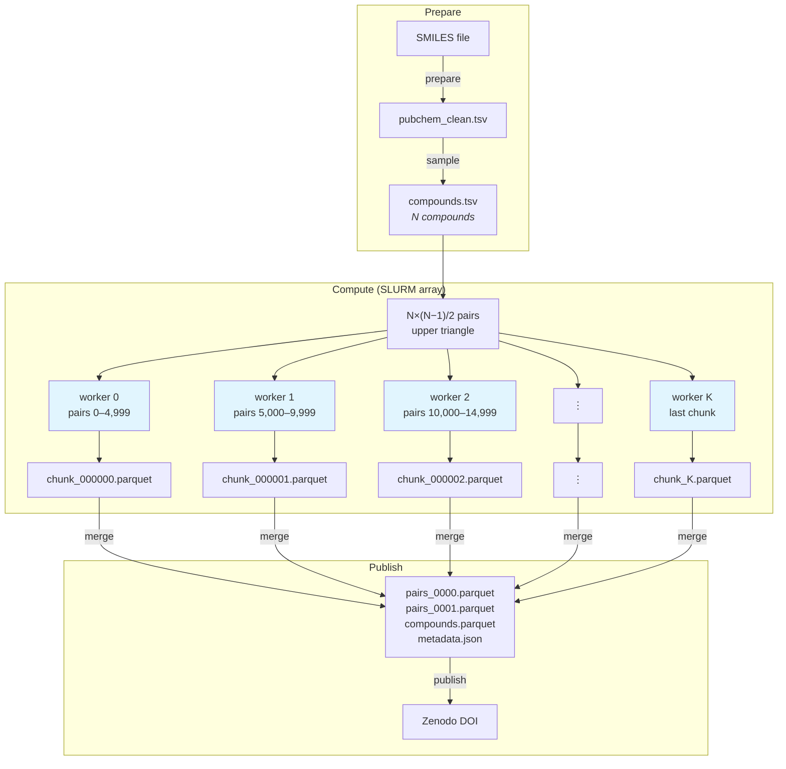

# pubchem-rascal-mces

[](https://github.com/LucaCappelletti94/pubchem-rascal-mces/actions/workflows/ci.yml)
[](https://www.python.org)
[](https://github.com/LucaCappelletti94/pubchem-rascal-mces/blob/main/LICENSE)

Large-scale computation of [RASCAL MCES](https://doi.org/10.1186/s13321-023-00733-9) (Maximum Common Edge Subgraph) similarity across chemical compound libraries.

MCES is the gold standard for measuring structural similarity between molecules: it finds the largest substructure two molecules share, accounting for both atoms and bonds. Unlike fingerprint-based methods (e.g. Tanimoto on Morgan fingerprints), MCES provides an exact, interpretable similarity grounded in chemical structure rather than a heuristic projection. The problem is NP-hard, but RASCAL makes it tractable through tight upper-bound screening. The resulting precomputed similarity matrices serve as ground-truth benchmarks for evaluating faster approximate methods, molecular property prediction models, and retrieval systems in cheminformatics and mass spectrometry.

## Setup

```bash
git clone git@github.com:LucaCappelletti94/pubchem-rascal-mces.git
cd pubchem-rascal-mces
uv sync
```

## How it works



Each worker receives a chunk ID and deterministically computes which pairs to process from the upper triangle of the pairwise matrix. No intermediate pair files are generated.

Output is zstd-compressed Parquet with columns: `cid_a`, `cid_b`, `similarity`, `timed_out`, `compute_time_ms`. A `compounds.parquet` file (CID, InChIKey, SMILES, HeavyAtomCount) is included alongside results to make the dataset self-contained.

## Experiments

### MassSpecGym (~31.6k compounds, ~499M pairs)

Complete pairwise MCES similarity for all molecules in [MassSpecGym](https://github.com/pluskal-lab/MassSpecGym), producing a ground-truth similarity matrix for mass spectrometry research.

```bash
# 1. Prepare: fetch from HuggingFace, normalize, deduplicate, filter
uv run rascal-mces prepare --source massspecgym

# 2. Sample: use all compounds
uv run rascal-mces sample --name massspecgym --all

# 3. Compute (locally for testing, or on SLURM for production)
uv run rascal-mces run-local --sample-name massspecgym --cores 8

# 3. (alt) Compute on SLURM
bash slurm/setup_env.sh           # once, on login node
mkdir -p logs
sbatch slurm/array_job.sh massspecgym

# 4. Merge and publish
uv run rascal-mces merge data/results/cluster/massspecgym data/results/merged/massspecgym \
    --compound-file data/samples/massspecgym.tsv
ZENODO_TOKEN=... uv run rascal-mces publish data/results/merged/massspecgym \
    --title "RASCAL MCES similarity for MassSpecGym compounds" \
    --description "Pairwise MCES similarity for 31,587 MassSpecGym molecules"
```

Each array task processes 50,000 pairs. Jobs skip automatically if their output file already exists, so the array is restart-safe.

For LBNL Lawrencium, use the cluster-specific wrappers in `slurm/lrc/`: `setup_env.sh`, `transfer_data.sh`, `submit.sh`, `status.sh`, and `merge.sh`.

### PubChem (~116M compounds, future)

Pairwise similarity across PubChem at scale. Uses stratified subsampling by heavy atom count to manage the quadratic scaling.

```bash
# Download PubChem CID-SMILES (~1.4 GB compressed)
uv run rascal-mces download

# Normalize all compounds
uv run rascal-mces prepare --cores 32

# Draw a stratified sample (e.g. 100k compounds)
uv run rascal-mces sample --name pubchem_100k --size 100000

# Submit to SLURM (adjust --array range to match reported chunk count)
sbatch slurm/array_job.sh pubchem_100k
```

#### Multi-cluster distribution

For large jobs, split chunks across clusters using an offset:

```bash
# Cluster A: chunks 0–49,999
sbatch --array=0-49999%200 slurm/array_job.sh pubchem_100k 0

# Cluster B: chunks 50,000–99,999
sbatch --array=0-49999%200 slurm/array_job.sh pubchem_100k 50000
```

The second argument is the chunk offset — `CHUNK_ID = SLURM_ARRAY_TASK_ID + OFFSET`. Copy the sample file (`data/samples/*.tsv`) to each cluster. After all clusters finish, collect the chunk parquet files into one directory and run `merge`.

## Development

```bash
uv sync --group dev
uv run pytest -v
uv run ruff check
uv run mypy rascal_mces/
```
