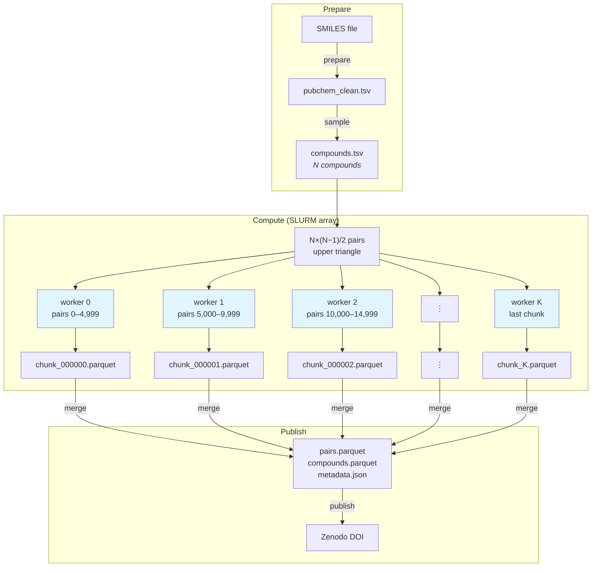
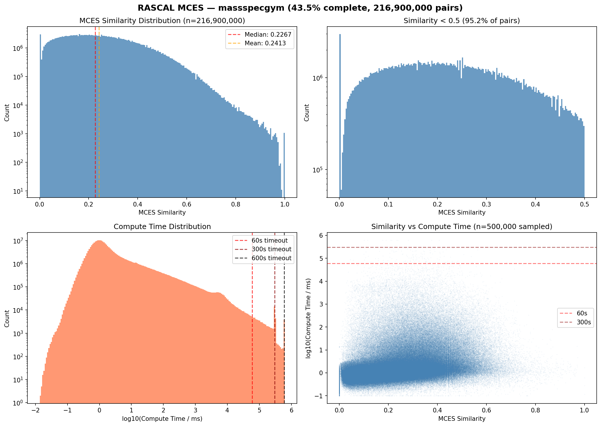
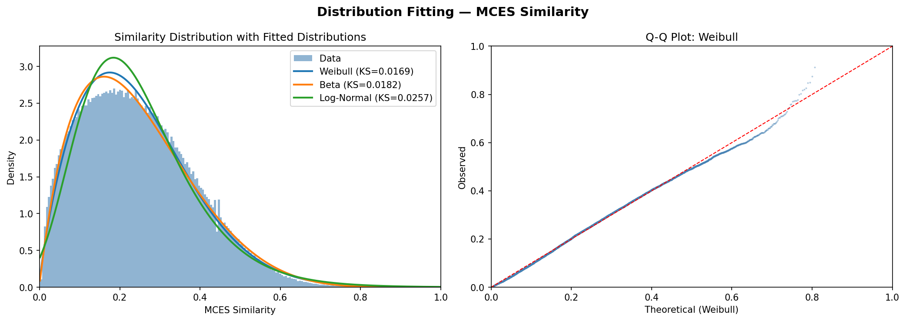

# pubchem-rascal-mces

[](https://github.com/LucaCappelletti94/pubchem-rascal-mces/actions/workflows/ci.yml)
[](https://www.python.org)
[](https://github.com/LucaCappelletti94/pubchem-rascal-mces/blob/main/LICENSE)
[](https://doi.org/10.5281/zenodo.19047066)

Large-scale computation of exact Maximum Common Edge Subgraph (MCES) similarity across chemical compound libraries, using the [RASCAL](https://doi.org/10.1186/s13321-023-00733-9) implementation in RDKit [\[3\]](#references).

MCES captures the chemical intuition of structural similarity between molecules better than fingerprint-based methods [\[1\]](#references), [\[2\]](#references): it finds the largest substructure two molecules share, accounting for both atoms and bonds. Unlike heuristic approaches (e.g. Tanimoto on Morgan fingerprints), MCES provides an exact, interpretable distance grounded in shared chemical substructure. The problem is NP-hard. We solve it exactly for every pair (RASCAL's similarity threshold is set to 0, disabling its screening optimization) with a per-pair timeout of 600 s. Pairs that exceed the timeout are flagged, not discarded. Computing all pairs without filtering is essential: a key goal is to study the correlation between MCES and faster approximate metrics (e.g. spectral similarity, fingerprint-based Tanimoto). These proxies tend to correlate well with MCES for highly similar pairs but break down for dissimilar ones. Skipping low-similarity pairs would hide exactly the regime where approximate methods fail, biasing any downstream comparison. The resulting precomputed similarity matrices serve as ground-truth benchmarks for evaluating faster approximate methods, molecular property prediction models, and retrieval systems in cheminformatics and mass spectrometry [\[4\]](#references). We are currently completing a pilot on [MassSpecGym](https://github.com/pluskal-lab/MassSpecGym) (31,587 compounds, ~499M pairs, 43.5% complete), which has already proved more challenging than initially expected: while most pairs resolve in milliseconds, the compute-time distribution has a heavy tail where a small fraction of pairs take orders of magnitude longer, dominating total runtime. No full PubChem run has been attempted yet. Preliminary results and analysis are below.

## Setup

```bash
git clone git@github.com:LucaCappelletti94/pubchem-rascal-mces.git
cd pubchem-rascal-mces
uv sync
```

## How it works



Each worker receives a chunk ID and deterministically computes which pairs to process from the upper triangle of the pairwise matrix. No intermediate pair files are generated.

Output is zstd-compressed Parquet with columns: `cid_a`, `cid_b`, `similarity`, `timed_out`, `compute_time_ms`. A `compounds.parquet` file (CID, InChIKey, SMILES, HeavyAtomCount) is included alongside results to make the dataset self-contained.

## Experiments

### MassSpecGym (~31.6k compounds, ~499M pairs)

Complete pairwise MCES similarity for all molecules in [MassSpecGym](https://github.com/pluskal-lab/MassSpecGym), producing a ground-truth similarity matrix for mass spectrometry research.

```bash
# 1. Prepare: fetch from HuggingFace, normalize, deduplicate, filter
uv run rascal-mces prepare --source massspecgym

# 2. Sample: use all compounds
uv run rascal-mces sample --name massspecgym --all

# 3. Compute (locally for testing, or on SLURM for production)
uv run rascal-mces run-local --sample-name massspecgym --cores 8

# 3. (alt) Compute on SLURM
bash slurm/setup_env.sh           # once, on login node
mkdir -p logs
sbatch slurm/array_job.sh massspecgym

# 4. Merge and publish
uv run rascal-mces merge data/results/cluster/massspecgym data/results/merged/massspecgym \
    --compound-file data/samples/massspecgym.tsv
ZENODO_TOKEN=... uv run rascal-mces publish data/results/merged/massspecgym \
    --title "RASCAL MCES similarity for MassSpecGym compounds" \
    --description "Pairwise MCES similarity for 31,587 MassSpecGym molecules"
```

Each array task processes 50,000 pairs. Jobs skip automatically if their output file already exists, so the array is restart-safe.

For LBNL Lawrencium, use the cluster-specific wrappers in `slurm/lrc/`: `setup_env.sh`, `submit.sh`, `status.sh`, and `merge.sh`. Ensure the sample TSV is available under `data/samples/` before submitting jobs.

#### Preliminary results (43.5% complete)

| Metric | Value |
|--------|-------|
| Compounds | 31,587 |
| Total pairs | 498,792,891 |
| Pairs computed | 216,900,000 (43.5%) |
| Chunks completed | 4,338 / 9,978 |
| Per-pair timeout | 600 s |
| Timeout rate | 0.01% (20,754 pairs) |

The similarity distribution has mean 0.241, median 0.227, and standard deviation 0.136. It is well-fit by Beta(α=2.04, β=6.23) and Weibull(c=1.82, scale=0.275).

| Threshold | Pairs ≥ threshold |
|-----------|-------------------|
| ≥ 0.1 | 88.5% |
| ≥ 0.3 | 28.4% |
| ≥ 0.5 | 4.2% |
| ≥ 0.7 | 0.3% |
| ≥ 0.9 | 0.01% |

1,085 pairs have similarity = 1.0, all stereochemical variants (same molecular graph, different spatial arrangement). MCES is stereo-agnostic by design. 4,704 of 31,587 compounds (14.9%) participate in at least one stereoisomer pair.

Per-pair compute time spans 5 orders of magnitude (< 1 ms to 600 s), with median ~3 ms and P99 ~1.3 s. There is an inverted-U pattern: the hardest pairs cluster at 0.3–0.4 similarity (large product graph, poor pruning), while very similar (> 0.9) and very dissimilar (< 0.1) pairs resolve quickly. Estimated ~30,000 node-hours for the full computation.





### PubChem (~116M compounds, future)

Pairwise similarity across PubChem at scale. Will require some advances in both algorithm and likely GPU parallelization, as the scale is wholly unmanageable for the current RDKit implementation.

```bash
# Download PubChem CID-SMILES (~1.4 GB compressed)
uv run rascal-mces download

# Normalize all compounds
uv run rascal-mces prepare --cores 32

# Draw a stratified sample (e.g. 100k compounds)
uv run rascal-mces sample --name pubchem_100k --size 100000

# Submit to SLURM (adjust --array range to match reported chunk count)
sbatch slurm/array_job.sh pubchem_100k
```

#### Multi-cluster distribution

For large jobs, split chunks across clusters using an offset:

```bash
# Cluster A: chunks 0–49,999
sbatch --array=0-49999%200 slurm/array_job.sh pubchem_100k 0

# Cluster B: chunks 50,000–99,999
sbatch --array=0-49999%200 slurm/array_job.sh pubchem_100k 50000
```

The second argument is the chunk offset: `CHUNK_ID = SLURM_ARRAY_TASK_ID + OFFSET`. Copy the sample file (`data/samples/*.tsv`) to each cluster. After all clusters finish, collect the chunk parquet files into one directory and run `merge`.

## Development

```bash
uv sync --group dev
uv run pytest -v
uv run ruff check
uv run mypy rascal_mces/
```

## References

1. Kretschmer, F., Seipp, J., Ludwig, M., Klau, G. W. & Böcker, S. Coverage bias in small molecule machine learning. *Nat. Commun.* **16**, 349 (2025). [doi:10.1038/s41467-024-55462-w](https://doi.org/10.1038/s41467-024-55462-w)
2. Raymond, J. W. & Willett, P. Maximum common subgraph isomorphism algorithms for the matching of chemical structures. *J. Comput.-Aided Mol. Des.* **16**, 521–533 (2002). [doi:10.1023/A:1021271615909](https://doi.org/10.1023/A:1021271615909)
3. Raymond, J. W., Gardiner, E. J. & Willett, P. RASCAL: Calculation of graph similarity using maximum common edge subgraphs. *Comput. J.* **45**, 631–644 (2002). [doi:10.1093/comjnl/45.6.631](https://doi.org/10.1093/comjnl/45.6.631)
4. Bushuiev, R. *et al.* MassSpecGym: A benchmark for the discovery and identification of molecules. *Advances in Neural Information Processing Systems* **37** (NeurIPS 2024). [arXiv:2410.23326](https://arxiv.org/abs/2410.23326)
